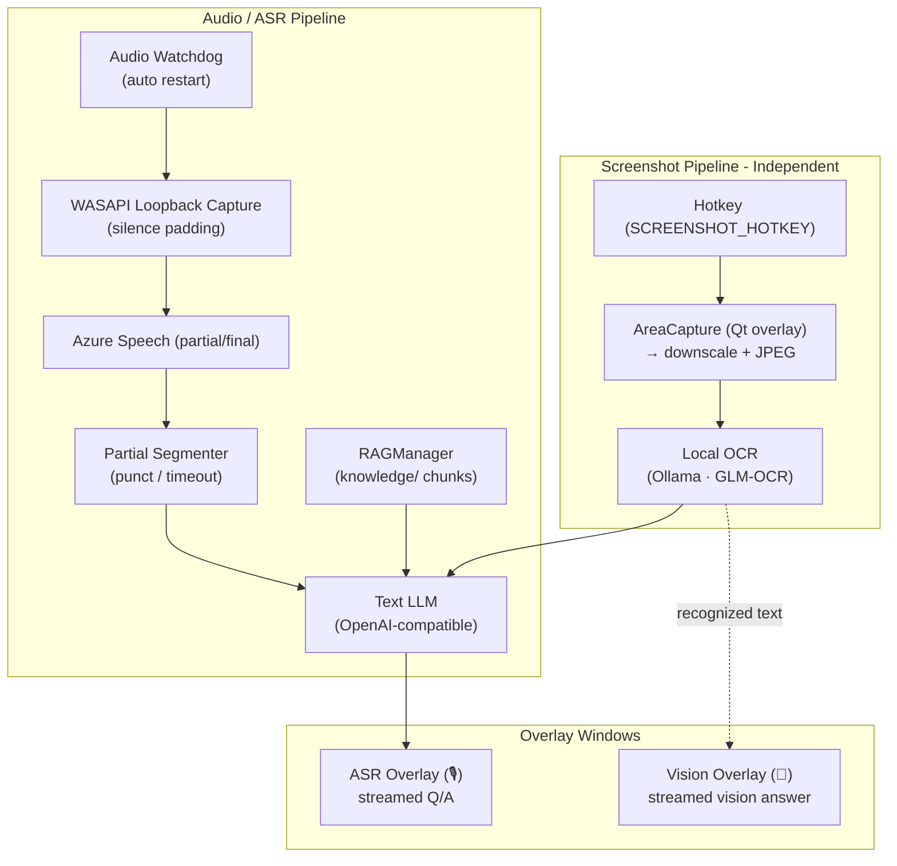
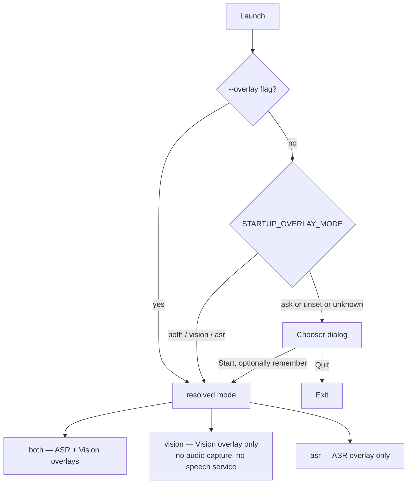

# GhostPilot

> **Status:** feature-complete for personal use (v0.9.0). Maintained on demand — no scheduled roadmap.

Desktop interview copilot for Windows: **invisible overlay** + **ASR → text LLM** + **screenshot → local OCR → text LLM**, with a local **hybrid RAG knowledge base**.

## What's new in v0.10.0

- **Ollama starts with the app** — screenshot OCR needs Ollama, and nothing started or checked it: launching from the desktop icon with Ollama down meant every screenshot failed with a raw `ConnectError` in the overlay, with no hint of the remedy. GhostPilot now starts a **local** Ollama at launch when it is not answering (a remote `OLLAMA_BASE_URL` is never touched) and preloads the OCR model, so the first screenshot skips the ~6s model load. Ollama's own Startup-folder shortcut means this is usually a ~1ms probe. See [screenshot OCR](#screenshot-ocr-local-glm-ocr).
- **Pick your overlay at launch** — GhostPilot opens a chooser (`Both overlays` / `Vision overlay only` / `ASR overlay only`) and can remember the answer; `python main.py --overlay vision` skips the dialog entirely. Vision-only mode never opens the loopback capture device and never starts the speech service — the right choice when you only want the screenshot → OCR → LLM route. See [Launch workflow](#launch-workflow-which-overlays-start).
- **Faster OCR, measured** — the stock `Text recognition:` prompt made GLM-OCR run past the page and repeat itself (one line emitted 164×; 1984 chars of which ~95% was garbage, 59-94s of decode). The prompt now asks for the text alone and an explicit stop: **59s → 12s on the same image with identical accuracy**, backstopped by a repetition guard for pages where the model loops anyway. Model kept resident between screenshots, and the image is normalised to a legible long edge. Shipped steady state is ~10s per screenshot with no runaways; see [measured latency](#measured-latency-i7-1165g7-4c8t-glm-ocr-11b-f16-num_ctx-16384).
- **Answers are no longer cut off mid-code-block** — the stream was capped at `max_tokens=450`, and **`deepseek-flash` is a reasoning model: its hidden chain-of-thought is billed against that same cap**, so the trace routinely ate the whole budget and the visible answer stopped wherever it had got to — typically right after the code fence's first line, i.e. a function header with no body. Measured: at a cap of 450 *and* at 1200 the reasoning trace consumed 100% of the budget and the visible answer was **empty**. The cap is therefore **removed by default (`ANSWER_MAX_TOKENS=0` = uncapped)**; when a provider does stop early the overlay says so, naming the reasoning share, and the per-turn usage row logs a `reasoning` field. See [answer length](#answer-length-answer_max_tokens-default-0--uncapped).
- **Local screenshot OCR** — the screenshot route no longer calls a cloud vision model. `SCREENSHOT_HOTKEY` captures a region (or `SCREENSHOT_FULL_HOTKEY` the whole monitor), the image is downscaled and sent to **GLM-OCR running in Ollama on your machine**, and the recognized text is streamed to the **DeepSeek V4** text model exactly like an ASR transcript. No image ever leaves the machine; only the recognized text does.
- **GLM-OCR setup helper** — `python setup_glm_ocr.py` pulls `glm-ocr`, pins the sampling parameters from `ocr/GLM-Config` (temperature 0, top_k 1, 16k context) and auto-detects your **physical** core count for `num_thread`.
- **DeepSeek V4 model names** — `TEXT_MODEL` defaults to `deepseek-flash` (V4.1-Flash); `deepseek-chat` was retired upstream in July 2026. Pricing table updated (`deepseek-flash`, `deepseek-v4-flash`, `deepseek-v4-pro`).
- **Simpler LLM plumbing** — the vision provider abstraction is gone (`VISION_MODEL`, `VISION_PROVIDER`, `VISION_PROVIDER_FALLBACK`, `VISION_HISTORY`, `prompts/vision.md`). One text provider, one OCR client.

### v0.8.0

- **Observability strip on the ASR footer** — each turn shows `provider · rag:N · ↑in · ↓out · cost · latency_ms` so you can verify which LLM answered, how many RAG snippets were injected, and how long it took.
- **Hot-reload RAG** — edit anything under `knowledge/` and the index rebuilds automatically (event-driven via `QFileSystemWatcher`, ~zero latency). Manual **Rebuild KB** button on the Prompts tab too.
- **Settings LLM tab is grouped** — Text generation / Vision / API keys / Ollama (local) section headers; combined with provider-aware row visibility nothing irrelevant is shown.
- **qtawesome icons** — emoji affordances replaced with Font Awesome glyphs (theme-aware, consistent across OSes). Graceful emoji fallback if qtawesome is missing.
- **Cross-platform audio scaffold** — macOS/Linux devs can now run the full pipeline via `AUDIO_BACKEND=sounddevice` (mic input). For system-audio loopback on macOS install [BlackHole](https://existential.audio/blackhole/) and route output to it; on Linux pick a Pulseaudio monitor source.

## Features

- Click-through stealth overlays (ASR + Vision) with synced hotkeys.
- WASAPI loopback capture → **Azure Speech** *or* **local faster-whisper** → segmenter → text LLM.
- Region or full-screen screenshot → **local GLM-OCR (Ollama)** → text LLM, independent pipeline.
- Multi-provider text LLM: **OpenAI · DeepSeek · Ollama (local)** through one OpenAI-compatible adapter; **Gemini** via `google-genai`.
- Hybrid RAG over `knowledge/` (BM25 + dense embeddings, RRF fused; embeddings load lazily).
- Multi-turn context (configurable depth), prompt preheat.
- Pricing/usage accounting, crash logger, conversation export, optional session recording.
- Secrets via OS keyring (with `.env` / `config.json` fallback).

## Architecture



## Quick start (Windows with venv)

```powershell
python -m venv .venv
.\.venv\Scripts\Activate.ps1

pip install -r requirements.txt
```

Create `.env` from `.env.example`, then run:

```powershell
python .\main.py
```

## Launch workflow (which overlays start)

The two pipelines are independent, and the ASR one is the heavy half: it opens
the WASAPI loopback device, keeps an audio watchdog running and streams to the
speech service. When you only want the screenshot route, none of that has to
start.



Resolution order: `--overlay <mode>` → `STARTUP_OVERLAY_MODE` (env or
`config.json`) → ask. The chooser also writes the pick to `config.json` when you
tick **Remember my choice**, so a later login/autostart launch goes straight to
the pipelines. An unknown value falls back to asking rather than starting nothing.

| Mode | Overlays | Audio capture / ASR |
| --- | --- | --- |
| `both` | ASR + Vision | started |
| `vision` | Vision only | **not started** |
| `asr` | ASR only | started |
| `ask` | chooser on every launch | depends on the answer |

The tray menu lives on the ASR overlay; in `vision` mode the Vision overlay
takes it over so Settings, recording and Quit stay reachable. Hotkeys that would
do nothing are not registered: no screenshot hotkeys without the Vision overlay,
no Vision-interaction hotkey without it either. In `vision`/`asr` mode the
"both overlays" hotkey simply acts on the single overlay that exists.

Set the default in the tray menu → **Settings → Startup → Overlay at launch**,
or per run:

```powershell
python .\main.py --overlay vision      # visual overlay only, no ASR service
```

## Background operation (tray-only, no taskbar button)

GhostPilot is a **per-user background process**: it lives in the system tray and
never owns a taskbar button. A real Windows *service* is not an option — Session
0 has no desktop, so the overlays, global hotkeys, screen capture and WASAPI
loopback capture would all be unavailable.

- **No console window.** Launched as `python main.py` (double-click, or a
  shortcut), the process re-spawns itself detached under `pythonw.exe` and exits
  the console. Launched *from* a terminal (`cmd`/PowerShell), it stays attached
  so you keep your logs — the relaunch only fires when the process owns its own
  console window.
- **No taskbar button.** Both overlays are `Qt.WindowType.Tool` windows and
  additionally get `WS_EX_TOOLWINDOW` (with `WS_EX_APPWINDOW` cleared) on show,
  which also drops them from Alt+Tab. The Settings dialog does the same.
- **Windowless launcher.** `GhostPilot.pyw` is the double-click entry point for
  source checkouts (Windows runs `.pyw` under `pythonw.exe`); the PyInstaller
  build is already `--noconsole`.
- **Start with Windows.** Tray menu → **Start with Windows** writes/removes a
  per-user entry under
  `HKCU\Software\Microsoft\Windows\CurrentVersion\Run` (no elevation, no service
  registration). It points at `pythonw.exe GhostPilot.pyw` for source checkouts
  and at the executable itself when frozen. Because a login launch starts in a
  different working directory, the app `chdir`s to its own root at startup so
  `config.json`, `.env`, `knowledge/` and `prompts/` still resolve.
- **Tray icon.** The tray/executable icon is `assets/icon.ico` (multi-size,
  16→256 px), shipped in the bundle and passed to PyInstaller via `build.py`'s
  `ICON_PATH`, so the exe and the tray entry share it. Without it the tray falls
  back to the qtawesome ghost glyph, then to a plain square.
- **Escape hatch.** `GHOSTPILOT_NO_RELAUNCH=1` disables the console-to-`pythonw`
  hand-off (useful when debugging startup in a console).
- **Logs when windowless.** With no stderr the console log handler is skipped and
  the rotating crash log (`%LOCALAPPDATA%/GhostPilot/logs/crash.log`) runs at
  `INFO` instead of `WARNING` — that file is the app's log when it runs in the
  background.

### Tray icon visibility (Windows 11)

Windows 11 hides new tray icons in the overflow flyout by default (the `^`
chevron next to the clock). To keep the GhostPilot icon always visible:

**Settings → Personalization → Taskbar → Other system tray icons →** enable
**GhostPilot**.

The app itself does not write the undocumented `NotifyIconSettings` registry key
that controls that flag — pinning it once via the Settings page above is the
supported path.

## Configuration

All config can be set via:
- **`.env`** (loaded at startup)
- **Settings UI** (writes `config.json`, which takes precedence)

### Required keys

- **ASR backend** (`ASR_BACKEND=azure` default, or `whisper` for offline):
  - Azure: `SPEECH_KEY`, `SPEECH_REGION` (or `ENDPOINT`)
  - Whisper: `pip install faster-whisper`, then tune `WHISPER_MODEL` (default `small`), `WHISPER_DEVICE` (`auto`/`cpu`/`cuda`), `WHISPER_COMPUTE_TYPE` (`int8` default), `WHISPER_WINDOW_SEC` (default `2.5`).
- **Text LLM** (pick one): `DEEPSEEK_API_KEY` (default) *or* `OPENAI_API_KEY` *or* a running Ollama server.
- **Screenshot OCR**: no key — a local Ollama server with the GLM-OCR model:

  ```powershell
  ollama pull glm-ocr
  python setup_glm_ocr.py        # creates glm-ocr-optimized (see ocr/GLM-Config)
  ```

### Screenshot OCR (local GLM-OCR)

Ollama must be running for OCR. You normally do not have to start it: Ollama's
installer registers a **Startup-folder** shortcut, so it is already up after a
login and GhostPilot's probe succeeds in ~1ms. GhostPilot also starts a **local**
Ollama itself at launch when it is not answering — covering a server that was
quit, crashed, its autostart disabled, or that simply had not finished booting
yet — and preloads the OCR model, so the first screenshot does not pay the ~6s
model load. A remote `OLLAMA_BASE_URL` is never started (it is someone else's
server). Disable with `OLLAMA_AUTOSTART=0`.

Without that fallback the failure was quiet and late: OCR was only attempted on
the screenshot hotkey, and an unreachable server surfaced as
`[⚠️ OCR Error: ... ConnectError]` in the Vision overlay — nothing at launch, and
no hint that the fix was "start Ollama".

| Setting | Default | Meaning |
| --- | --- | --- |
| `OLLAMA_BASE_URL` | `http://localhost:11434/v1` | Ollama endpoint (shared with the Ollama text provider) |
| `OLLAMA_AUTOSTART` | `1` | Start a local Ollama at launch if it is not answering |
| `OCR_MODEL` | `glm-ocr-optimized` | Model created by `setup_glm_ocr.py` |
| `OCR_PROMPT` | `Transcribe all text in this image. Output only the text.` | Recognition prompt sent with every screenshot |
| `OCR_MAX_DIMENSION` | `1024` | Longest edge (px) the screenshot is scaled down to |
| `OCR_MIN_DIMENSION` | `1024` | Longest edge it is scaled **up** to |
| `OCR_TIMEOUT_SEC` | `180.0` | httpx *read* timeout (only fires when the stream stalls) |
| `OCR_TOTAL_TIMEOUT_SEC` | `120.0` | Wall-clock budget for one recognition |
| `OCR_KEEP_ALIVE` | `30m` | How long Ollama holds the model resident |
| `OCR_NUM_PREDICT` | `1024` | Cap on tokens generated per screenshot |
| `OCR_REPEAT_GUARD_LINES` | `12` | Abandon a stream repeating the same output |

Recognition streams token-by-token, so the Vision overlay shows the text as it
is recognized (`OCR · …` in the status line) before the answer starts streaming.
Failures are reported in the overlay only — the ASR pipeline is unaffected.

#### Why OCR sometimes took minutes (and what bounds it now)

GLM-OCR runs at temperature 0 / top_k 1. Past the end of a page it does not
stop: it latches onto the last token group (usually ``` ``` ```) and repeats it.
Measured on a 4-core laptop CPU, one 1080p screenshot:

```
"Text recognition:"   59-94s   one line emitted 164×   1984 chars (~95% garbage)
```

Three independent bounds make a runaway impossible:

- `OCR_NUM_PREDICT` caps generated tokens per request.
- `OCR_TOTAL_TIMEOUT_SEC` caps wall-clock time. `OCR_TIMEOUT_SEC` alone cannot:
  it is an httpx *read* timeout, and a looping generation keeps producing data,
  so it never fires.
- the repetition guard abandons a stream repeating the same output 12 times,
  keeping the text recognized so far.

#### Measured latency (i7-1165G7, 4C/8T, GLM-OCR 1.1B F16, `num_ctx` 16384)

The cost splits into three parts, and the split decides which knob matters:

| stage | cost | scales with |
| --- | --- | --- |
| model load | ~6s, only after eviction | weight size |
| vision prefill | **32s at 1024px**, 21s at 768, 6.5s at 512 | vision tokens (~60ms each) |
| decode | ~15 tok/s → `num_tokens / 15` seconds | output length |

Because decode dominates a looping run but prefill dominates a clean one, both
levers matter:

- **The prompt is the biggest single win.** The stock `Text recognition:` prefix
  *causes* the loop. `Transcribe all text in this image. Output only the text.`
  terminates cleanly on the same image with **identical accuracy**
  (100% ground-truth words both ways) and drops 59s → 12s. It is the shipped
  default; the guard still backstops pages it does not fix.
- **Image size trades accuracy for prefill.** Measured word recovery:
  1024px → 100%, 768px → 95%, 640px → 100% (one sample), 512px → 76%.
  `OCR_MAX_DIMENSION`/`OCR_MIN_DIMENSION` default to 1024 for fidelity; 768 saves
  ~10s per new screenshot if you accept the risk.
- **`OCR_KEEP_ALIVE=30m`**: Ollama evicts an idle model after 5 minutes and the
  reload is ~6s (plus it re-pays prefill), which lands on the next screenshot.
- **Quantization does not help here.** q8_0 and q4_K_M measured the same decode
  rate as F16 (59-68s per 1024 tokens), and q4 returned an incomplete stream.
- **Threads give ~15%**: `num_thread 8` vs `4` measured 13.6s vs 15.9s per 290
  tokens; not worth oversubscribing 4 physical cores.

Steady state as shipped: **~10s per screenshot** for a clean page (A: 9.6s,
C: 10.3s) and ~10.5s for a page the model loops on (guard stops it), versus
43-94s before.

If a recognition is cut short (cap, deadline, or repetition) the partial text is
still used — the status line says so, so a partial transcript is never mistaken
for a complete one.

### Text LLM providers

Provider is inferred from `TEXT_MODEL` but can be forced via `TEXT_PROVIDER`:

| Provider | `TEXT_PROVIDER` | Example `TEXT_MODEL` | Key |
| --- | --- | --- | --- |
| DeepSeek | `deepseek` | `deepseek-flash` (V4.1-Flash) / `deepseek-v4-pro` | `DEEPSEEK_API_KEY` |
| OpenAI | `openai` | `gpt-4o-mini` | `OPENAI_API_KEY` |
| Ollama (local) | `ollama` | `llama3.1` / `qwen2.5` / `ollama/<name>` | n/a (`OLLAMA_BASE_URL`) |
| Gemini | `gemini` | `gemini-2.5-flash` | `GEMINI_API_KEY` |

#### Provider failover (optional)

Set `TEXT_PROVIDER_FALLBACK` to a comma-separated chain. If the primary
provider raises **before** emitting any tokens (rate-limit, network error,
etc.), the engine transparently retries against the next provider and flashes
a footer note `failover from <prev>`.

```
TEXT_PROVIDER=deepseek
TEXT_PROVIDER_FALLBACK=openai,gemini
```

Mid-stream errors are *not* retried (the user has already seen partial text).

### Usage log (cost & latency history)

Every text-`usage` event is appended as one JSON line to
`~/.ghostpilot/usage.jsonl` (override with `USAGE_LOG_PATH`). Each record
carries `ts`, `provider`, `model`, `in`/`out` token counts, `total_ms`, and
`ttft_ms` so you can post-hoc analyse spend and latency without
re-instrumenting. Disable with `USAGE_LOG_ENABLED=0`. OCR contributes no cost
(it runs locally) but its turns are logged like any other with `kind: vision`.

### Multi-turn context

- `CONTEXT_TURNS` (default `0`) — number of prior (Q, A) pairs fed back to the text model.

### Answer length (`ANSWER_MAX_TOKENS`, default `0` = uncapped)

Every answer streams through one provider call. The output cap is **`0` by
default, meaning uncapped** — the provider applies its own output limit.

The reason is that a caller-set cap is a trap with a reasoning model.
`deepseek-flash` writes its hidden chain-of-thought **before** the visible
answer, and both are billed against the same `max_tokens` budget. The trace
length varies per run, so a fixed cap is a coin flip. Measured on one algorithm
question:

| cap | output tokens | reasoning | visible answer |
| --- | --- | --- | --- |
| 450 | 450 | 450 | **0 chars** — the whole budget went to reasoning |
| 1200 | 1200 | 1200 | **0 chars** — same failure, bigger number |
| 4500 (server limit on provider) | 1376 | 1241 | complete code block |

That is the "function header but no function body" symptom: the model had
written `[I]` and the code fence and was just starting the body when the
reasoning trace exhausted the budget. Raising the number only makes truncation
less likely; it does not remove it. Uncapped, the same question finished in 963
output tokens (828 of them reasoning) with the code block closed and the `[R]`
line present.

Set `ANSWER_MAX_TOKENS` to a positive value only to bound cost, accepting that
truncation becomes possible again. Providers report truncation *only* through
`finish_reason`, which the engine now detects and surfaces:

```
[⚠️ truncated — stopped at the model's own output limit (980 of them spent on hidden reasoning before the answer)]
```

with the wording pointing at `ANSWER_MAX_TOKENS` instead when that setting is
what did the cutting.

### Hotkeys (two overlays)

- **Screenshot → OCR**:
  - `SCREENSHOT_HOTKEY` (default `alt+p`) — drag a region
  - `SCREENSHOT_FULL_HOTKEY` (default `alt+shift+p`) — capture the primary monitor
- **Both overlays interaction (click-through ↔ draggable, synced)**:
  - `ASR_INTERACTION_HOTKEY` / `ASR_INTERACTION_HOTKEY_BACKUP` (default `alt+a` / `ctrl+alt+a`)
- **Vision overlay interaction (click-through ↔ draggable)**:
  - `VISION_INTERACTION_HOTKEY` / `VISION_INTERACTION_HOTKEY_BACKUP`
- **Safety (force both overlays click-through)**:
  - `FORCE_STEALTH_HOTKEY` / `FORCE_STEALTH_HOTKEY_BACKUP`

### ASR overlay text

- `ASR_OVERLAY_MAX_CONVERSATIONS` (default `3`): trim the ASR overlay body to the last *N* conversation blocks (blocks are separated the same way as between turns in the UI). Set to `0` for unlimited history.

### Local knowledge base (hybrid RAG)

Put your resume/cheatsheets/notes under `knowledge/` (default).

- `KNOWLEDGE_DIR=knowledge`
- `KNOWLEDGE_PATTERNS=*.md,*.txt`
- `KNOWLEDGE_CHUNK_CHARS=900`, `KNOWLEDGE_OVERLAP_CHARS=120`
- `RAG_MIN_SCORE=0.32` — drop chunks below this cosine similarity.

On startup the app reads + chunks those files and builds:
- a **BM25** index (via `rank-bm25`) — always available, instant.
- a **dense embedding** index (via `sentence-transformers`) — loaded lazily on first query if installed.

Both rankings are fused with Reciprocal Rank Fusion and the top matches are injected into the text LLM prompt.

#### Algorithm patterns cheatsheet (`ALGORITHM_KNOWLEDGE_FILE`)

Algorithm turns are answered from a cheatsheet injected **whole**, not
retrieved:

- `ALGORITHM_KNOWLEDGE_FILE=algorithm.md` — name (found at any depth under
  `KNOWLEDGE_DIR`) or an absolute path. Empty disables the injection.
- `ALGORITHM_KNOWLEDGE_MAX_CHARS=8000` — safety bound; a larger file is cut with
  a visible `[cheatsheet truncated]` marker and a warning, never dropped.

Whole rather than retrieved because a cheatsheet's value is its structure — a
900-char chunk of it reads as a fragment — and because this route must not
depend on retrieval quality. The file is re-read on every algorithm turn, so
edits apply to the next question with no restart.

The shipped `knowledge/algorithm.md` is a starter (pattern triggers, loop
shapes, traps). Measure before growing it: the 2.1 KB default costs ≈0.6 k input
tokens on **every** algorithm turn — see the `algo:Nc` figure in the overlay
footer.

Retrieval is unchanged for the other routes, and the footer keeps the two
separate: `rag:N` counts retrieved snippets, `algo:Nc` the injected cheatsheet.


## Notes / troubleshooting

- **PyQt6 DLL load failed**: prefer installing PyQt/Qt via conda-forge (`conda install -c conda-forge pyqt=6 qt-main`) and make sure VC++ 2015-2022 x64 runtime is installed.
- **Screenshot/OCR failures**: the screenshot pipeline is isolated; failures show only in the Vision overlay and never stop ASR. `Ollama model missing` → run `ollama pull glm-ocr && python setup_glm_ocr.py`. `Ollama unreachable` → GhostPilot starts a local server by itself, so this means the endpoint is remote/unreachable, `OLLAMA_AUTOSTART=0`, or the `ollama` executable is not installed; check the log for the `src.ollama_boot` lines.
- **macOS / Linux dev mode**: `pip install -r requirements.txt` skips `pyaudiowpatch` automatically (it's `; sys_platform == "win32"`-gated) and installs `sounddevice` instead. Set `AUDIO_BACKEND=sounddevice` to use the mic, or install [BlackHole](https://existential.audio/blackhole/) (mac) / route to a Pulseaudio monitor (linux) for real system-audio loopback.
- **KB auto-rebuild**: tweak with `KB_WATCH_INTERVAL_SEC` (default `5`; sets debounce window when QFileSystemWatcher is active; set `0` to disable both watcher and polling fallback).

## Settings UI

Open from the system tray (right-click → Settings) or the gear button on the ASR overlay. Tabs:

- **Startup** — which overlay(s) to open at launch (`Ask me each launch` / `Both` / `Vision only, no ASR service` / `ASR only`); applies to the next launch
- **Azure** — Speech key / region / endpoint, ASR language, **ASR backend selector** (Azure ↔ Whisper)
- **LLM** — grouped into *Text generation* / *Screenshot OCR (local)* / *API keys* / *Ollama (local)* sections. Provider dropdown + a master **Test selected providers** button (runs a text health check in parallel with an OCR check that the Ollama model is pulled)
- **Hotkeys** — all bindings (primary + backup)
- **Language** — LLM response language (`auto` / `zh` / `en`)
- **Prompts** — edit system prompts (algorithm / behavioral / technical) + **Rebuild KB** button; edits persist to a per-user dir (`%APPDATA%/GhostPilot/prompts` on Windows, `~/Library/Application Support/GhostPilot/prompts` on macOS, `~/.config/GhostPilot/prompts` on Linux) so they survive frozen-build upgrades

Secret fields all have a show/hide toggle. Most changes apply immediately — no restart needed.

## Session recording & export

- **Export current conversation** from the ASR overlay (writes Markdown to disk).
- **Session recorder** (opt-in, minimal): when enabled, appends each finalized Q/A to a JSONL file under the user data dir for later review.

## Security

- API keys preferred storage: **OS keyring** (`keyring`). Falls back to `.env` and `config.json` for compatibility.
- `.env` and `config.json` are in `.gitignore` — never commit them. Plain-text fallback is plain text; treat the files accordingly.
- The app never sends keys anywhere except to the configured providers (Azure / OpenAI / DeepSeek / Gemini / your local Ollama).
- Screenshots are OCR'd **locally** by Ollama; the image itself is never uploaded. Only the recognized text is sent to the configured text provider. Screenshots are not persisted to disk unless session recording is enabled.
- Crash logs are written locally under the user data dir; they may contain prompts but never API keys.
- For best operational hygiene: use a separate API key per machine and rotate periodically.
