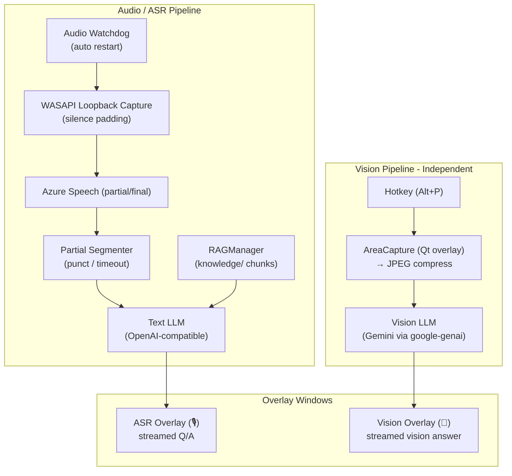

# GhostPilot

> **Status:** feature-complete for personal use (v0.9.0). Maintained on demand — no scheduled roadmap.

Desktop interview copilot for Windows: **invisible overlay** + **ASR → text LLM** + **Alt+P screenshot → multimodal LLM**, with a local **hybrid RAG knowledge base**.

## What's new in v0.8.0

- **Observability strip on the ASR footer** — each turn shows `provider · rag:N · ↑in · ↓out · cost · latency_ms` so you can verify which LLM answered, how many RAG snippets were injected, and how long it took.
- **Hot-reload RAG** — edit anything under `knowledge/` and the index rebuilds automatically (event-driven via `QFileSystemWatcher`, ~zero latency). Manual **Rebuild KB** button on the Prompts tab too.
- **Settings LLM tab is grouped** — Text generation / Vision / API keys / Ollama (local) section headers; combined with provider-aware row visibility nothing irrelevant is shown.
- **qtawesome icons** — emoji affordances replaced with Font Awesome glyphs (theme-aware, consistent across OSes). Graceful emoji fallback if qtawesome is missing.
- **Cross-platform audio scaffold** — macOS/Linux devs can now run the full pipeline via `AUDIO_BACKEND=sounddevice` (mic input). For system-audio loopback on macOS install [BlackHole](https://existential.audio/blackhole/) and route output to it; on Linux pick a Pulseaudio monitor source.

## Features

- Click-through stealth overlays (ASR + Vision) with synced hotkeys.
- WASAPI loopback capture → **Azure Speech** *or* **local faster-whisper** → segmenter → text LLM.
- Alt+P region screenshot → vision LLM (Gemini / OpenAI), independent pipeline.
- Multi-provider text LLM: **OpenAI · DeepSeek · Ollama (local)** through one OpenAI-compatible adapter; **Gemini** via `google-genai`.
- Hybrid RAG over `knowledge/` (BM25 + dense embeddings, RRF fused; embeddings load lazily).
- Multi-turn context (configurable depth), vision screenshot history, prompt preheat.
- Pricing/usage accounting, crash logger, conversation export, optional session recording.
- Secrets via OS keyring (with `.env` / `config.json` fallback).

## Architecture



## Quick start (Conda on Windows)

```powershell
conda create -n ghost-pilot python=3.12 -y
conda activate ghost-pilot

pip install -r requirements.txt
```

Create `.env` from `.env.example`, then run:

```powershell
python .\main.py
```

## Configuration

All config can be set via:
- **`.env`** (loaded at startup)
- **Settings UI** (writes `config.json`, which takes precedence)

### Required keys

- **ASR backend** (`ASR_BACKEND=azure` default, or `whisper` for offline):
  - Azure: `SPEECH_KEY`, `SPEECH_REGION` (or `ENDPOINT`)
  - Whisper: `pip install faster-whisper`, then tune `WHISPER_MODEL` (default `small`), `WHISPER_DEVICE` (`auto`/`cpu`/`cuda`), `WHISPER_COMPUTE_TYPE` (`int8` default), `WHISPER_WINDOW_SEC` (default `2.5`).
- **Vision (Gemini default)**: `GEMINI_API_KEY`, `VISION_MODEL=gemini-...`
- **Text LLM** (pick one): `OPENAI_API_KEY` *or* `DEEPSEEK_API_KEY` *or* a running Ollama server.

### Text LLM providers

Provider is inferred from `TEXT_MODEL` but can be forced via `TEXT_PROVIDER`:

| Provider | `TEXT_PROVIDER` | Example `TEXT_MODEL` | Key |
| --- | --- | --- | --- |
| DeepSeek | `deepseek` | `deepseek-chat` | `DEEPSEEK_API_KEY` |
| OpenAI | `openai` | `gpt-4o-mini` | `OPENAI_API_KEY` |
| Ollama (local) | `ollama` | `llama3.1` / `qwen2.5` / `ollama/<name>` | n/a (`OLLAMA_BASE_URL=http://localhost:11434/v1`) |

Vision provider similarly via `VISION_PROVIDER` (`gemini` / `openai`).

#### Provider failover (optional)

Set `TEXT_PROVIDER_FALLBACK` (and/or `VISION_PROVIDER_FALLBACK`, see caveat
below) to a comma-separated chain. If the primary provider raises **before**
emitting any tokens (rate-limit, network error, etc.), the engine
transparently retries against the next provider and flashes a footer note
`failover from <prev>`.

```
TEXT_PROVIDER=openai
TEXT_PROVIDER_FALLBACK=deepseek,gemini
```

Mid-stream errors are *not* retried (the user has already seen partial text).

> **Vision caveat:** vision payloads differ between provider families (gemini
> takes parts; openai-compat takes chat messages). The engine builds the
> payload for the *primary* provider, so vision failover only works between
> providers of the **same family** (e.g. `openai → deepseek`, both
> openai-compatible). A cross-family fallback chain will error at request
> time on the fallback provider.

### Usage log (cost & latency history)

Every text-`usage` and vision-`latency` event is appended as one JSON line to
`~/.ghostpilot/usage.jsonl` (override with `USAGE_LOG_PATH`). Each record
carries `ts`, `provider`, `model`, `in`/`out` token counts (text path),
`total_ms`, and `ttft_ms` so you can post-hoc analyse spend and latency
without re-instrumenting. Disable with `USAGE_LOG_ENABLED=0`.

### Multi-turn context & vision history

- `CONTEXT_TURNS` (default `0`) — number of prior (Q, A) pairs fed back to the text model.
- `VISION_HISTORY` (default `5`) — recent screenshots retained for re-asking.

### Hotkeys (two overlays)

- **Screenshot (Vision)**:
  - `SCREENSHOT_HOTKEY` (default `alt+p`)
- **Both overlays interaction (click-through ↔ draggable, synced)**:
  - `ASR_INTERACTION_HOTKEY` / `ASR_INTERACTION_HOTKEY_BACKUP` (default `alt+a` / `ctrl+alt+a`)
- **Vision overlay interaction (click-through ↔ draggable)**:
  - `VISION_INTERACTION_HOTKEY` / `VISION_INTERACTION_HOTKEY_BACKUP`
- **Safety (force both overlays click-through)**:
  - `FORCE_STEALTH_HOTKEY` / `FORCE_STEALTH_HOTKEY_BACKUP`

### ASR overlay text

- `ASR_OVERLAY_MAX_CONVERSATIONS` (default `3`): trim the ASR overlay body to the last *N* conversation blocks (blocks are separated the same way as between turns in the UI). Set to `0` for unlimited history.

### Local knowledge base (hybrid RAG)

Put your resume/cheatsheets/notes under `knowledge/` (default).

- `KNOWLEDGE_DIR=knowledge`
- `KNOWLEDGE_PATTERNS=*.md,*.txt`
- `KNOWLEDGE_CHUNK_CHARS=900`, `KNOWLEDGE_OVERLAP_CHARS=120`
- `RAG_MIN_SCORE=0.32` — drop chunks below this cosine similarity.

On startup the app reads + chunks those files and builds:
- a **BM25** index (via `rank-bm25`) — always available, instant.
- a **dense embedding** index (via `sentence-transformers`) — loaded lazily on first query if installed.

Both rankings are fused with Reciprocal Rank Fusion and the top matches are injected into the text LLM prompt.

## Notes / troubleshooting

- **PyQt6 DLL load failed**: prefer installing PyQt/Qt via conda-forge (`conda install -c conda-forge pyqt=6 qt-main`) and make sure VC++ 2015-2022 x64 runtime is installed.
- **Alt+P / Vision failures**: vision pipeline is isolated; failures should show only in the Vision overlay and not stop ASR.
- **macOS / Linux dev mode**: `pip install -r requirements.txt` skips `pyaudiowpatch` automatically (it's `; sys_platform == "win32"`-gated) and installs `sounddevice` instead. Set `AUDIO_BACKEND=sounddevice` to use the mic, or install [BlackHole](https://existential.audio/blackhole/) (mac) / route to a Pulseaudio monitor (linux) for real system-audio loopback.
- **KB auto-rebuild**: tweak with `KB_WATCH_INTERVAL_SEC` (default `5`; sets debounce window when QFileSystemWatcher is active; set `0` to disable both watcher and polling fallback).

## Settings UI

Open from the system tray (right-click → Settings) or the gear button on the ASR overlay. Tabs:

- **Azure** — Speech key / region / endpoint, ASR language, **ASR backend selector** (Azure ↔ Whisper)
- **LLM** — grouped into *Text generation* / *Vision* / *API keys* / *Ollama (local)* sections. Provider dropdowns + a master **Test selected providers** button (runs text + vision health checks in parallel, incl. Ollama `/api/tags`)
- **Hotkeys** — all bindings (primary + backup)
- **Language** — LLM response language (`auto` / `zh` / `en`)
- **Prompts** — edit system prompts (algorithm / behavioral / technical / vision) + **Rebuild KB** button; edits persist to a per-user dir (`%APPDATA%/GhostPilot/prompts` on Windows, `~/Library/Application Support/GhostPilot/prompts` on macOS, `~/.config/GhostPilot/prompts` on Linux) so they survive frozen-build upgrades

Secret fields all have a show/hide toggle. Most changes apply immediately — no restart needed.

## Session recording & export

- **Export current conversation** from the ASR overlay (writes Markdown to disk).
- **Session recorder** (opt-in, minimal): when enabled, appends each finalized Q/A to a JSONL file under the user data dir for later review.

## Security

- API keys preferred storage: **OS keyring** (`keyring`). Falls back to `.env` and `config.json` for compatibility.
- `.env` and `config.json` are in `.gitignore` — never commit them. Plain-text fallback is plain text; treat the files accordingly.
- The app never sends keys anywhere except to the configured providers (Azure / OpenAI / DeepSeek / Gemini / your local Ollama).
- Screenshots taken via `Alt+P` are sent to the configured vision model and are not persisted to disk (unless session recording is enabled).
- Crash logs are written locally under the user data dir; they may contain prompts but never API keys.
- For best operational hygiene: use a separate API key per machine and rotate periodically.
