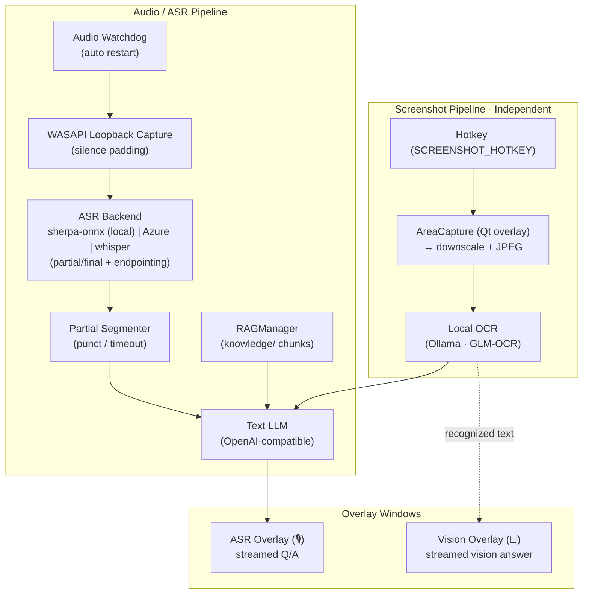
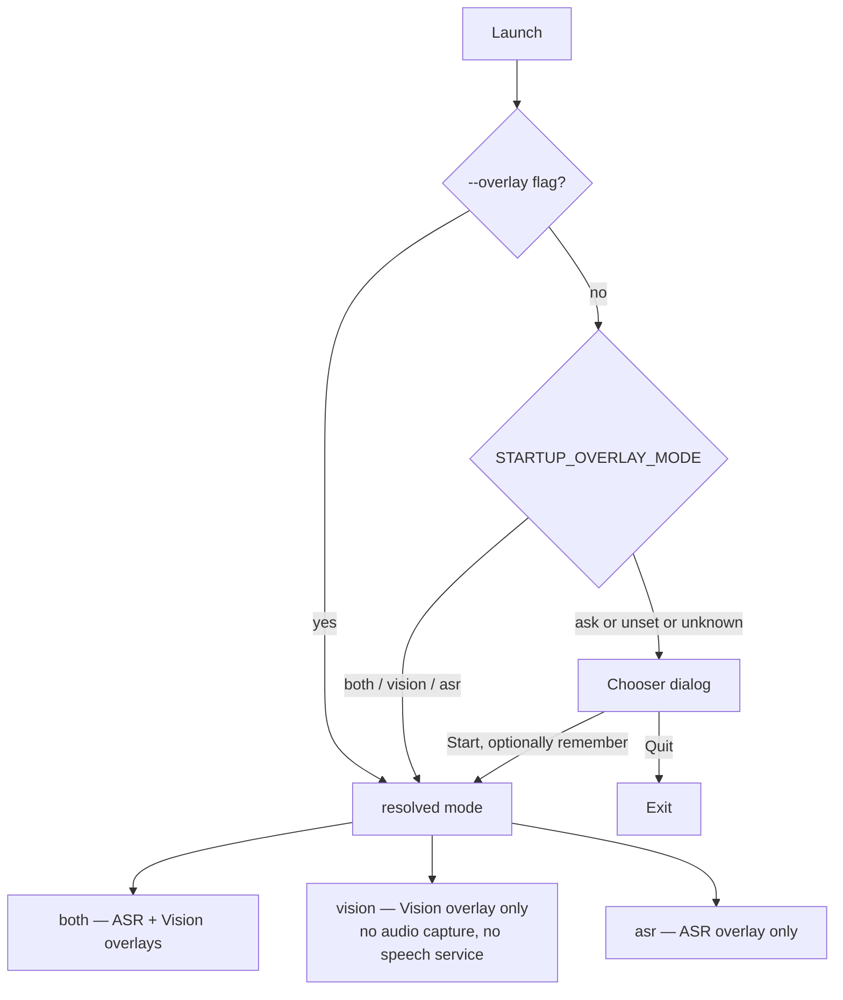

# GhostPilot

> **Status:** feature-complete for personal use (v0.9.0). Maintained on demand — no scheduled roadmap.

Desktop interview copilot for Windows: **invisible overlay** + **ASR → text LLM** + **screenshot → local OCR → text LLM**, with a local **hybrid RAG knowledge base**.

## What's new in v0.10.0

- **`caps` works as a hotkey (it never did)** — `SCREENSHOT_FULL_HOTKEY=Caps` shipped in `.env.example`, but the `keyboard` library has no `caps` alias (it knows `capslock` / `caps lock`), so `add_hotkey` raised inside `start()` where the failure was one log line: the documented key did nothing, silently. Key names are now normalised (`caps`, `caps-lock`, `capslock`, `Caps`) and a lone latching key is registered **suppressed**, so Caps Lock takes a screenshot *without* also flipping the toggle — a combo like `alt+p` stays unsuppressed, since suppressing it would swallow a key you type. Anything that still fails to register is reported at startup and rendered dead in the overlay footer (`caps ✗ full`). See [hotkeys](#hotkeys-two-overlays).
- **A code-shaped screenshot is always answered with code, and the code is never missing** — the screenshot route now checks the OCR transcript's *shape* (a fence, or two line-level code markers) and routes it to the algorithm prompt even when the classifier called it `technical` — the shape whose answer is one tab-separated line with **no code block at all**. Reproduced live: an OCR'd listing classified as `technical`, override applied, answer came back as a complete `[I]` block. On top of that, an `algorithm` turn that finishes without any code block is re-asked **once** for exactly one fenced block; if that also fails the overlay says the code is missing instead of leaving prose that looks deliberate. Truncation is not repaired (the code is already on screen). See [question routing](#question-routing-which-answer-structure-you-get).
- **Local ASR (sherpa-onnx)** — a third `ASR_BACKEND`, fully offline: no key, no per-minute billing, audio never leaves the machine. Models are genuinely streaming, so partials appear as words are spoken and the model's own endpoint detector ends the utterance. `pip install sherpa-onnx && python setup_sherpa_asr.py`, then `ASR_BACKEND=sherpa`. See [Local ASR](#local-asr-sherpa-onnx).
- **English interview → Chinese answers** — `RESPONSE_LANGUAGE=zh` is what makes this work; the prompts answer in Chinese only when the question is *not* clearly English, and an English interview is always that case, so `auto`/`en` both produce English. See [answer language](#required-keys).
- **English coding questions now reach the coding prompt** — the keyword classifier's vocabulary was almost entirely Chinese (数组 / 排序 / 复杂度) with a handful of English technique names, so "given an array of intervals, merge the overlapping ones" matched nothing and fell through to the *technical* prompt: one tab-separated line, **no code block**. That is the common case for an English interview. The classifier now knows English data structures and phrasing, distinguishes generic verbs (*describe*, *challenge*) from unambiguous story markers, and recognises CS subjects so a design question is not answered as a personal anecdote.
- **A repeated OCR transcript is no longer treated as an incomplete one** — GLM-OCR reads a screenshot correctly and then keeps going: it re-emits the page inside a code fence, invents a code block and re-emits that, or collapses into fence spam. Measured across 768/1024/1280/1600 px, PNG/JPEG and light/dark/inverted screenshots, the recognition was byte-perfect every time and everything after it was repetition (one 1600x900 page: real text ended at char 738 of a 2041-char transcript). The old behaviour reported that as `OCR incomplete` — pointing users at `OCR_NUM_PREDICT`, which makes it *worse* — and fed the duplicate to the answer model as part of the question. Now the guard stops the stream as soon as the output replays itself (424 chunks/165s → 30-215 chunks/20s on the same images), the replay is cut out of the transcript, and only a genuine token-cap or wall-clock stop raises a warning. Detection is deliberately conservative, because a false positive would silently delete the question: a page of numbered requirements repeats its `Constraints:` line in every section, and a looser rule cut that 1910-char document to 287 chars. See [screenshot OCR](#screenshot-ocr-local-glm-ocr).
- **A truncated screenshot is no longer answered silently** — when OCR hits its token cap, wall-clock budget or repetition guard, the partial transcript is still used (discarding it would throw away a usable question) but the shortfall is now written **into the answer body**. It used to be a status line, which the very next `answer_start` wiped — so a half-transcribed code listing was answered as though it were complete, with nothing on screen saying otherwise.
- **sherpa-onnx language mismatches are reported** — `ASR_LANGUAGE` is an Azure setting; a local model's language is fixed at download time. A mismatch transcribes nothing while every status line still looks healthy, so the backend now states the model's coverage and warns when the two disagree (English audio + a zh-only model).
- **Ollama starts with the app** — screenshot OCR needs Ollama, and nothing started or checked it: launching from the desktop icon with Ollama down meant every screenshot failed with a raw `ConnectError` in the overlay, with no hint of the remedy. GhostPilot now starts a **local** Ollama at launch when it is not answering (a remote `OLLAMA_BASE_URL` is never touched) and preloads the OCR model, so the first screenshot skips the ~6s model load. Ollama's own Startup-folder shortcut means this is usually a ~1ms probe. See [screenshot OCR](#screenshot-ocr-local-glm-ocr).
- **Pick your overlay at launch** — GhostPilot opens a chooser (`Both overlays` / `Vision overlay only` / `ASR overlay only`) and can remember the answer; `python main.py --overlay vision` skips the dialog entirely. Vision-only mode never opens the loopback capture device and never starts the speech service — the right choice when you only want the screenshot → OCR → LLM route. See [Launch workflow](#launch-workflow-which-overlays-start).
- **Faster OCR, measured** — the stock `Text recognition:` prompt made GLM-OCR run past the page and repeat itself (one line emitted 164×; 1984 chars of which ~95% was garbage, 59-94s of decode). The prompt now asks for the text alone and an explicit stop: **59s → 12s on the same image with identical accuracy**, backstopped by a repetition guard for pages where the model loops anyway. Model kept resident between screenshots, and the image is normalised to a legible long edge. Shipped steady state is ~10s per screenshot with no runaways; see [measured latency](#measured-latency-i7-1165g7-4c8t-glm-ocr-11b-f16-num_ctx-16384).
- **Answers are no longer cut off mid-code-block** — the stream was capped at `max_tokens=450`, and **`deepseek-flash` is a reasoning model: its hidden chain-of-thought is billed against that same cap**, so the trace routinely ate the whole budget and the visible answer stopped wherever it had got to — typically right after the code fence's first line, i.e. a function header with no body. Measured: at a cap of 450 *and* at 1200 the reasoning trace consumed 100% of the budget and the visible answer was **empty**. The cap is therefore **removed by default (`ANSWER_MAX_TOKENS=0` = uncapped)**; when a provider does stop early the overlay says so, naming the reasoning share, and the per-turn usage row logs a `reasoning` field. See [answer length](#answer-length-answer_max_tokens-default-0--uncapped).
- **Local screenshot OCR** — the screenshot route no longer calls a cloud vision model. `SCREENSHOT_HOTKEY` captures a region (or `SCREENSHOT_FULL_HOTKEY` the whole monitor), the image is downscaled and sent to **GLM-OCR running in Ollama on your machine**, and the recognized text is streamed to the **DeepSeek V4** text model exactly like an ASR transcript. No image ever leaves the machine; only the recognized text does.
- **GLM-OCR setup helper** — `pip install gguf && python setup_glm_ocr.py` pulls `glm-ocr`, **registers its missing end-of-generation token** (Ollama's GGUF ships without `tokenizer.ggml.eot_token_id`, so the model literally cannot stop and runs to the token cap — the `repeat token` / limit-exceeded failure; measured 2000 tok/141 s → 21 tok/7.3 s), pins the sampling parameters from `ocr/GLM-Config` (temperature 0, top_k 1, 16k context) and auto-detects your **physical** core count for `num_thread`.
- **DeepSeek V4 model names** — `TEXT_MODEL` defaults to `deepseek-flash` (V4.1-Flash); `deepseek-chat` was retired upstream in July 2026. Pricing table updated (`deepseek-flash`, `deepseek-v4-flash`, `deepseek-v4-pro`).
- **Simpler LLM plumbing** — the vision provider abstraction is gone (`VISION_MODEL`, `VISION_PROVIDER`, `VISION_PROVIDER_FALLBACK`, `VISION_HISTORY`, `prompts/vision.md`). One text provider, one OCR client.

### v0.8.0

- **Observability strip on the ASR footer** — each turn shows `provider · rag:N · ↑in · ↓out · cost · latency_ms` so you can verify which LLM answered, how many RAG snippets were injected, and how long it took.
- **Hot-reload RAG** — edit anything under `knowledge/` and the index rebuilds automatically (event-driven via `QFileSystemWatcher`, ~zero latency). Manual **Rebuild KB** button on the Prompts tab too.
- **Settings LLM tab is grouped** — Text generation / Vision / API keys / Ollama (local) section headers; combined with provider-aware row visibility nothing irrelevant is shown.
- **qtawesome icons** — emoji affordances replaced with Font Awesome glyphs (theme-aware, consistent across OSes). Graceful emoji fallback if qtawesome is missing.
- **Cross-platform audio scaffold** — macOS/Linux devs can now run the full pipeline via `AUDIO_BACKEND=sounddevice` (mic input). For system-audio loopback on macOS install [BlackHole](https://existential.audio/blackhole/) and route output to it; on Linux pick a Pulseaudio monitor source.

## Features

- Click-through stealth overlays (ASR + Vision) with synced hotkeys.
- WASAPI loopback capture → **sherpa-onnx** *(local, offline)* *or* **Azure Speech** *or* **local faster-whisper** → segmenter → text LLM.
- Region or full-screen screenshot → **local GLM-OCR (Ollama)** → text LLM, independent pipeline.
- Multi-provider text LLM: **OpenAI · DeepSeek · Ollama (local)** through one OpenAI-compatible adapter; **Gemini** via `google-genai`.
- Hybrid RAG over `knowledge/` (BM25 + dense embeddings, RRF fused; embeddings load lazily).
- Multi-turn context (configurable depth), prompt preheat.
- Pricing/usage accounting, crash logger, conversation export, optional session recording.
- Secrets via OS keyring (with `.env` / `config.json` fallback).

## Architecture


```mermaid
flowchart TD
  subgraph UI[Overlay Windows]
    ASR_UI["ASR Overlay (🎙️)<br/>streamed Q/A"]
    V_UI["Vision Overlay (📸)<br/>streamed vision answer"]
  end

  subgraph Audio[Audio / ASR Pipeline]
    AC["WASAPI Loopback Capture<br/>(silence padding)"]
    WD["Audio Watchdog<br/>(auto restart)"]
    AZ["ASR Backend<br/>sherpa-onnx (local) | Azure | whisper<br/>(partial/final + endpointing)"]
    SEG["Partial Segmenter<br/>(punct / timeout)"]
    RAG["RAGManager<br/>(knowledge/ chunks)"]
    TEXTLLM["Text LLM<br/>(OpenAI-compatible)"]
  end

  subgraph Vision[Screenshot Pipeline - Independent]
    HKP["Hotkey (SCREENSHOT_HOTKEY)"]
    CAP["AreaCapture (Qt overlay)<br/>→ downscale + JPEG"]
    OCR["Local OCR<br/>(Ollama · GLM-OCR)"]
  end

  AC --> AZ --> SEG --> TEXTLLM --> ASR_UI
  WD --> AC
  RAG --> TEXTLLM

  HKP --> CAP --> OCR --> TEXTLLM
  OCR -. "recognized text" .-> V_UI
```

## Quick start (Windows with venv)

```powershell
python -m venv .venv
.\.venv\Scripts\Activate.ps1

pip install -r requirements.txt
```

Create `.env` from `.env.example`, then run:

```powershell
python .\main.py
```

## Launch workflow (which overlays start)

The two pipelines are independent, and the ASR one is the heavy half: it opens
the WASAPI loopback device, keeps an audio watchdog running and streams to the
speech service. When you only want the screenshot route, none of that has to
start.


```mermaid
flowchart TD
  L[Launch] --> F{"--overlay flag?"}
  F -->|yes| M[resolved mode]
  F -->|no| C{"STARTUP_OVERLAY_MODE"}
  C -->|both / vision / asr| M
  C -->|ask or unset or unknown| D[Chooser dialog]
  D -->|Start, optionally remember| M
  D -->|Quit| Q[Exit]
  M --> B["both — ASR + Vision overlays"]
  M --> V["vision — Vision overlay only<br/>no audio capture, no speech service"]
  M --> A["asr — ASR overlay only"]
```

Resolution order: `--overlay <mode>` → `STARTUP_OVERLAY_MODE` (env or
`config.json`) → ask. The chooser also writes the pick to `config.json` when you
tick **Remember my choice**, so a later login/autostart launch goes straight to
the pipelines. An unknown value falls back to asking rather than starting nothing.

| Mode | Overlays | Audio capture / ASR |
| --- | --- | --- |
| `both` | ASR + Vision | started |
| `vision` | Vision only | **not started** |
| `asr` | ASR only | started |
| `ask` | chooser on every launch | depends on the answer |

The tray menu lives on the ASR overlay; in `vision` mode the Vision overlay
takes it over so Settings, recording and Quit stay reachable. Hotkeys that would
do nothing are not registered: no screenshot hotkeys without the Vision overlay,
no Vision-interaction hotkey without it either. In `vision`/`asr` mode the
"both overlays" hotkey simply acts on the single overlay that exists.

Set the default in the tray menu → **Settings → Startup → Overlay at launch**,
or per run:

```powershell
python .\main.py --overlay vision      # visual overlay only, no ASR service
```

## Background operation (tray-only, no taskbar button)

GhostPilot is a **per-user background process**: it lives in the system tray and
never owns a taskbar button. A real Windows *service* is not an option — Session
0 has no desktop, so the overlays, global hotkeys, screen capture and WASAPI
loopback capture would all be unavailable.

- **No console window.** Launched as `python main.py` (double-click, or a
  shortcut), the process re-spawns itself detached under `pythonw.exe` and exits
  the console. Launched *from* a terminal (`cmd`/PowerShell), it stays attached
  so you keep your logs — the relaunch only fires when the process owns its own
  console window.
- **No taskbar button.** Both overlays are `Qt.WindowType.Tool` windows and
  additionally get `WS_EX_TOOLWINDOW` (with `WS_EX_APPWINDOW` cleared) on show,
  which also drops them from Alt+Tab. The Settings dialog does the same.
- **Windowless launcher.** `GhostPilot.pyw` is the double-click entry point for
  source checkouts (Windows runs `.pyw` under `pythonw.exe`); the PyInstaller
  build is already `--noconsole`.
- **Start with Windows.** Tray menu → **Start with Windows** writes/removes a
  per-user entry under
  `HKCU\Software\Microsoft\Windows\CurrentVersion\Run` (no elevation, no service
  registration). It points at `pythonw.exe GhostPilot.pyw` for source checkouts
  and at the executable itself when frozen. Because a login launch starts in a
  different working directory, the app `chdir`s to its own root at startup so
  `config.json`, `.env`, `knowledge/` and `prompts/` still resolve.
- **Tray icon.** The tray/executable icon is `assets/icon.ico` (multi-size,
  16→256 px), shipped in the bundle and passed to PyInstaller via `build.py`'s
  `ICON_PATH`, so the exe and the tray entry share it. Without it the tray falls
  back to the qtawesome ghost glyph, then to a plain square.
- **Escape hatch.** `GHOSTPILOT_NO_RELAUNCH=1` disables the console-to-`pythonw`
  hand-off (useful when debugging startup in a console).
- **Logs when windowless.** With no stderr the console log handler is skipped and
  the rotating crash log (`%LOCALAPPDATA%/GhostPilot/logs/crash.log`) runs at
  `INFO` instead of `WARNING` — that file is the app's log when it runs in the
  background.

### Tray icon visibility (Windows 11)

Windows 11 hides new tray icons in the overflow flyout by default (the `^`
chevron next to the clock). To keep the GhostPilot icon always visible:

**Settings → Personalization → Taskbar → Other system tray icons →** enable
**GhostPilot**.

The app itself does not write the undocumented `NotifyIconSettings` registry key
that controls that flag — pinning it once via the Settings page above is the
supported path.

## Configuration

All config can be set via:
- **`.env`** (loaded at startup)
- **Settings UI** (writes `config.json`, which takes precedence)

### Required keys

- **ASR backend** (`ASR_BACKEND=azure` default, `sherpa` or `whisper` for offline):
  - Azure: `SPEECH_KEY`, `SPEECH_REGION` (or `ENDPOINT`)
  - sherpa-onnx: `pip install sherpa-onnx`, then `python setup_sherpa_asr.py` (see below). No key, no billing — audio never leaves the machine.
  - Whisper: `pip install faster-whisper`, then tune `WHISPER_MODEL` (default `small`), `WHISPER_DEVICE` (`auto`/`cpu`/`cuda`), `WHISPER_COMPUTE_TYPE` (`int8` default), `WHISPER_WINDOW_SEC` (default `2.5`).
- **Text LLM** (pick one): `DEEPSEEK_API_KEY` (default) *or* `OPENAI_API_KEY` *or* a running Ollama server.
- **Answer language**: `RESPONSE_LANGUAGE=auto | zh | en` (default `en`).
  `zh` is the one to set for an **English interview answered in Chinese**: the
  prompts themselves answer in Chinese only when the question is *not* clearly
  English, and an English interview is exactly that case — so `auto` and `en`
  both produce English answers. Only `zh` forces Chinese (and it applies to both
  overlays).
- **Screenshot OCR**: no key — a local Ollama server with the GLM-OCR model:

  ```powershell
  ollama pull glm-ocr
  pip install gguf
  python setup_glm_ocr.py        # creates glm-ocr-optimized (see ocr/GLM-Config)
                                 # and registers GLM-OCR's end-of-generation token
  ```

### Local ASR (sherpa-onnx)

Runs the recognizer on your machine: no API key, no per-minute billing, and
audio never leaves the box. Models are genuinely streaming, so partials appear
as words are spoken and the model's own endpoint detector decides where an
utterance ends.

```powershell
pip install sherpa-onnx
python setup_sherpa_asr.py --list     # known models, with download sizes
python setup_sherpa_asr.py            # default: zipformer bilingual zh+en (~511 MB)
```

Then set `ASR_BACKEND=sherpa` (`.env` or Settings → **Speech**). The model
downloads on first use if you skip the script (`SHERPA_AUTODOWNLOAD=0` to
forbid that and get the exact command in the log instead).

Known models (`SHERPA_MODEL`):

| Name | Languages | Download | Measured word recall\* |
|---|---|---|---|
| `zipformer-en-kroko` | English | **54 MB** | **96% / 94%** |
| `zipformer-bilingual-zh-en` *(default)* | Chinese + English | 511 MB | 89% / 53% |
| `zipformer-small-bilingual-zh-en` | Chinese + English | 458 MB | — |
| `zipformer-zh-14M` | Chinese | 74 MB | — |
| `zipformer-en-20M` | English | 128 MB | 50% / 35% |
| `paraformer-bilingual-zh-en` | Chinese + English | 1048 MB | — |

\* Word recall on two synthesized English sentences (see below). Not a benchmark —
just enough to show the differences are large and not close.

**For English interviews use `zipformer-en-kroko`.** It is the smallest model in
the set *and* the most accurate on English, and it is the only one that returns
properly cased, punctuated text (`tell me about a time when you had to deliver a
project. How did you handle…`) instead of unpunctuated upper case.

`zipformer-en-20M` is **not recommended**: on both test sentences it dropped the
opening words of the utterance, returning `T UNDER A VERY TIGHT DEAD LINE` for
"tell me about a time when you had to deliver a project under a very tight
deadline". It was the worst of the three English-capable models at both accuracy
and output quality. It is left in the registry because removing a documented
option is a bigger call than flagging it.

`SHERPA_MODEL` may also be a **path** to any already-extracted model directory
containing `tokens.txt`, an `*encoder*.onnx` and a `*decoder*.onnx` (int8 is
preferred automatically) — nothing is downloaded in that mode.

Notes:

- **Speaker labels are not available.** The local models emit `speaker:
  "Unknown"`; Azure's `ConversationTranscriber` is the only backend here that
  separates speakers. sherpa-onnx's diarization is offline-only.
- **`ASR_LANGUAGE` does not apply here.** It is an Azure setting; a sherpa-onnx
  model's language is fixed when you download it. The backend logs which
  languages the selected model covers, and warns when `ASR_LANGUAGE` names one
  it does not — English audio through a zh-only model transcribes to nothing
  while every status line still looks healthy. For English interviews,
  `zipformer-en-kroko` (54 MB) is both the smallest model covering English and
  the most accurate one measured; the bilingual default covers both languages.
- **Punctuation and casing depend on the model.** The bilingual and `en-20M`
  models emit unpunctuated upper case (`TELL ME ABOUT A TIME WHEN YOU HAD TO
  DELIVER A PROJECT`); `zipformer-en-kroko` emits proper sentence case and
  punctuation. Either way nothing is added *server-side* the way Azure does it,
  so GhostPilot's "finalize on `?`/`。`" heuristic (`ASR_PUNCTUATION_FINALIZE`)
  only fires when the model itself produced the punctuation — with Kroko it will,
  with the others it will not. Utterances otherwise end on the model's endpoint
  signal or the silence timeout.
- **`SHERPA_RULE2_SILENCE_SEC` must stay below `ASR_PARTIAL_SILENCE_MS`/1000**
  (default 0.5 s vs 0.65 s). The router finalizes from the last partial on that
  timer as well; if the timer won the race, the utterance would be answered
  twice — once from the partial, once from the backend's final. The client logs
  a warning at startup when the values are inverted.
- **CPU cost is real** and shares cores with the OCR model. `SHERPA_NUM_THREADS`
  defaults to `min(4, cpu_count)`; lower it if screenshot OCR slows down.
- Accuracy on your own audio is the thing to measure. `setup_sherpa_asr.py`
  ships no benchmark — compare against Azure on recorded interview audio before
  switching a live setup over.

### How the speech models were compared

Two English sentences were synthesized with the Windows SAPI voice
(`System.Speech.Synthesis`), resampled to 16 kHz, and fed through the real
client in 160 ms chunks **in real time** — feeding faster than real time
produces no events at all, because the recognizer is streaming and needs audio
to arrive over wall-clock time to emit partials. Recall is the share of
reference words recovered (order-insensitive).

Caveat: synthesized speech is not a substitute for the real thing — no room
noise, no accents, no crosstalk. It is enough to rank these models, not to
predict your accuracy. For accents and noisy audio, measure on your own
recordings. Rerun with `python setup_sherpa_asr.py --list` to see what is
downloaded, and swap `SHERPA_MODEL` to compare.

### Speaker labels (`speaker="Unknown"`)

The sherpa-onnx and faster-whisper backends always report `speaker: "Unknown"`;
only Azure's `ConversationTranscriber` separates speakers. **This does not
affect transcription, routing or answering.** `speaker` is display metadata: it
is interpolated into the log line, the recorded transcript and the block header,
and is never compared, indexed or branched on anywhere in the codebase — so the
pipeline behaves identically whether the label is `Unknown`, `Guest-1` or
anything else. `tests/test_asr_router.py` pins that: the same utterance routes
the same way for every label, including a missing key. The only consequence is
that the overlay header reads `[Unknown] …` instead of a name.

### Question routing (which answer structure you get)

Each transcript is classified and answered with a different prompt, so the
*shape* of what appears in the overlay depends on the routing. A coding question
routed to the technical prompt produces a one-line answer with no code at all.

| Routed as | Prompt | Structure in the overlay |
| --- | --- | --- |
| `behavioral` | behavioral.md | Four tagged lines — STAR `[S] [T] [A] [R]`, or WYEC `[W] [Y] [E] [C]` for fit/motivation questions |
| `algorithm` | algorithm.md | `[U] [M] [P]` line, then `[I]` and a fenced code block, then `[R]` complexity |
| `technical` | technical.md | One line, `[R] [E] [A] [C] [T]` separated by real tabs |

A fast DeepSeek call classifies first; the keyword classifier is the fallback if
that call fails. The order it applies is deliberate:

1. unambiguous story/fit markers win outright — *"tell me about a time you
   optimized a slow database query"* is a past story even though it names a
   database;
2. coding vocabulary → `algorithm`;
3. concepts/systems vocabulary → `technical`, so *"what are the challenges of
   eventual consistency"* is not answered as a personal anecdote;
4. generic verbs alone (*describe*, *challenge*) only count as behavioral when no
   CS subject was named;
5. otherwise `technical`.

Two guarantees sit on top of that, because getting the route wrong costs the
*coding* answer entirely:

- **A code-shaped screenshot is always answered with code.** The screenshot
  route checks the OCR transcript's shape before trusting the classifier: a
  transcript with a fence, or with two line-level code markers (a line ending in
  `;`/`{`/`}` or opening with `def`/`class`/`function`/`for`/`return`/…), routes
  to `algorithm` even when the classifier said `technical`. This is the
  measured failure it fixes: an OCR'd listing has little prose for a classifier
  to read, and the `technical` prompt answers in one tab-separated line — no
  code at all (reproduced live: classifier returned `technical`, the override
  turned it into a `[I]` block).
- **An `algorithm` turn that produced no code block is re-asked once.** The
  prompt requires the fence, but a model can still answer a coding question in
  prose, and the user cannot tell that from a deliberate answer. One extra call
  asks for exactly one fenced block; if that also fails, the overlay says so
  instead of leaving a prose answer that looks intentional. Truncation is *not*
  repaired — the code is already on screen and a re-ask cannot un-cut it.

Overlay rendering of these structures is covered by `tests/test_overlay_render.py`
(fence indentation under token streaming, open fences mid-stream, tab columns).
The answer *shape* is asserted structurally in `tests/format_contract.py`, which
parses each answer into prose and code segments and checks tags, line count,
separators and language per segment — plus that Python blocks actually compile,
which is how a truncated listing is caught (`tests/test_answer_format.py`).

A measured caveat: across 9 live `technical` answers, 8 used the required real
TAB separators and **1** returned a single line with bold-wrapped tags
(`**[R]** … **[E]** …`) and no tabs. It stays readable, but the column layout is
lost. If it recurs, the prompt is the thing to tune, not the renderer.

### Screenshot OCR (local GLM-OCR)

Ollama must be running for OCR. You normally do not have to start it: Ollama's
installer registers a **Startup-folder** shortcut, so it is already up after a
login and GhostPilot's probe succeeds in ~1ms. GhostPilot also starts a **local**
Ollama itself at launch when it is not answering — covering a server that was
quit, crashed, its autostart disabled, or that simply had not finished booting
yet — and preloads the OCR model, so the first screenshot does not pay the ~6s
model load. A remote `OLLAMA_BASE_URL` is never started (it is someone else's
server). Disable with `OLLAMA_AUTOSTART=0`.

Without that fallback the failure was quiet and late: OCR was only attempted on
the screenshot hotkey, and an unreachable server surfaced as
`[⚠️ OCR Error: ... ConnectError]` in the Vision overlay — nothing at launch, and
no hint that the fix was "start Ollama".

| Setting | Default | Meaning |
| --- | --- | --- |
| `OLLAMA_BASE_URL` | `http://localhost:11434/v1` | Ollama endpoint (shared with the Ollama text provider) |
| `OLLAMA_AUTOSTART` | `1` | Start a local Ollama at launch if it is not answering |
| `OCR_MODEL` | `glm-ocr-optimized` | Model created by `setup_glm_ocr.py` (which also repairs the end-of-generation token — re-run after re-pulling `glm-ocr`) |
| `OCR_PROMPT` | `Transcribe all text in this image. Output only the text.` | Recognition prompt sent with every screenshot (selects the output task/format, not whether generation stops) |
| `OCR_MAX_DIMENSION` | `1024` | Longest edge the screenshot is scaled down to — prefill scales with the *downscaled* pixel count, so this is the main cost control |
| `OCR_MIN_DIMENSION` | `0` | Longest edge it is scaled **up** to; `0` = never upscale (measured to add no accuracy at 5× the cost) |
| `OCR_TIMEOUT_SEC` | `180.0` | httpx *read* timeout (only fires when the stream stalls) |
| `OCR_TOTAL_TIMEOUT_SEC` | `120.0` | Wall-clock budget for one recognition |
| `OCR_KEEP_ALIVE` | `30m` | How long Ollama holds the model resident |
| `OCR_NUM_PREDICT` | `1024` | Backstop cap on tokens per screenshot — never reached once the end-of-generation token is registered; raising it buys more repetition, not a better transcript |
| `OCR_REPEAT_GUARD_LINES` | `12` | Abandon a stream repeating the same *line* 12× (the replay guard handles the rest) |

Recognition streams token-by-token, so the Vision overlay shows the text as it
is recognized (`OCR · …` in the status line) before the answer starts streaming.
Failures are reported in the overlay only — the ASR pipeline is unaffected.

#### The real cause: GLM-OCR ships without an end-of-generation token

Ollama's `glm-ocr` GGUF has no `tokenizer.ggml.eot_token_id`. `<|user|>` — the
token the model emits to end its turn — is therefore not an end-of-generation
token, and the model **cannot stop**. It transcribes the screenshot correctly
and then keeps going, re-emitting the page until something else ends the
request. On Ollama ≥ 0.34.1 the byte-identical replay also trips llama.cpp's
token-repeat guard, which is where users see `repeat token` / limit-exceeded
errors; on 0.35.0 the replay is fence-wrapped instead, so it survives as 2000
tokens of duplicated transcript.

Verified on this machine (Ollama 0.35.0, `glm-ocr` F16, CPU), one synthetic
banner and one full code page:

| | unpatched | after registering `<|user|>` as EOG |
| --- | --- | --- |
| dense text page | 2000 tok / 152 s, page re-emitted | **334 tok / 70 s**, clean |
| short text image | 2000 tok / 141 s, line repeated 60× | **21 tok / 7.3 s**, clean |

`python setup_glm_ocr.py` now applies this repair: it copies the base GGUF,
writes the end-of-generation id with the `gguf` package, and builds the model
from the repaired copy. It is idempotent (a model that already carries the id is
left alone), skips rather than half-writes when there is not enough disk for the
second 2.2 GB copy, and degrades to a warning — with the repetition guard still
in place — when `gguf` is missing. **Re-run it after re-pulling `glm-ocr`**, and
after upgrading a model created before this change.

Two things worth recording because they are the obvious wrong fixes:

- **The prompt is not the cause.** The native `Text Recognition:` prompt and the
  shipped prompt both ran to `num_predict` on the same image. Measured
  head-to-head, `stop: ["```"]` is what terminated generation unpatched — the
  prompt only selects the output *format* (the native prompts switch to table
  HTML / LaTeX).
- **`PARAMETER stop "<|user|>"` cannot fix it.** A stop sequence is matched
  against decoded output text, and `<|user|>` is a control token that never
  appears there. Only the GGUF metadata decides what llama.cpp stops on.

#### The model repeats itself — and that is not an incomplete transcript

GLM-OCR reads a screenshot correctly and then keeps going. Measured across every
configuration tried (768/1024/1280/1600 px, PNG/JPEG, light/dark/inverted
themes), the recognition was **byte-perfect** and everything after it was
repetition: it re-emits the page inside a code fence, invents a code block and
re-emits that, or collapses into fence spam. On one 1600x900 page the real text
ended at char 738 of a 2041-char transcript, with the same page transcribed
twice and invented Python after it. That is the missing-EOG runaway described
above; with the repair applied, the sampled pages stop at exactly the page text
(1027 chars, no invented block).

So a loop is not a recognition failure, and reporting it as one was wrong in
three ways: the overlay said `OCR incomplete` about a transcript that had the
whole page, the advice to raise `OCR_NUM_PREDICT` made it *worse* (a bigger cap
buys more duplication), and the duplicate itself was fed to the answer model as
part of the question. What happens now:

- **The guard stops the stream** once the tail of the output repeats an earlier
  part of it — measured 424 chunks/165s to 30-215 chunks/20s on the same images.
- **`trim_repetition` cuts the replay out**, leaving the recognition. On the
  measured transcripts: an exact cut back to the real page end where the text was
  the only thing replayed, and removal of the duplicate plus the invented block
  where it was not.
- **No `OCR incomplete` warning for a loop.** Only a token-cap or wall-clock stop
  can genuinely be missing its ending, and only that raises the warning.

A `trim_repetition` false positive would silently delete the question, so the
detection is deliberately conservative — it needs a long replay
(`_MIN_DUPLICATE_CHARS`), or a doubled tail, or a run of structural markers, and
is a no-op on everything the model produced once. That bar is measured, not
guessed: a page of numbered requirements repeats its `Constraints:` line verbatim
in every section, and a looser rule cut that 1910-char document down to 287 chars.

**Known limit.** The model sometimes appends *one* invented code block after the
page, without replaying it. Content emitted once is indistinguishable from
recognition, and the only signal that separates them is "a code fence opened
after a long run of prose" — which would also delete the legitimate sample code
on a problem-statement-plus-code screenshot. That trade is not worth taking, so
the block is left in the transcript; it follows the real question, and the answer
model is already told the transcript may be mis-recognized. Measured rate on a
synthetic 1600x900 page: 6 of 8 runs (the page itself was read correctly in all
of them, and no run reported the transcript as incomplete).

Three preprocessing levers were measured against that behaviour and none of them
is the fix, which is why none of them shipped:

| lever | measured |
| --- | --- |
| resolution 768 / 1024 / 1280 / 1600 px | 1024 is best; 1280/1600 *invent more* and cost 3-6× the prefill |
| PNG vs JPEG q85 | identical transcripts |
| inverting a dark screenshot (dark UI → black on white) | no improvement: 4/4 runs still appended an invented block |

#### Incomplete recognition is visible in the answer

A screenshot can still exceed a recognition budget (`OCR_NUM_PREDICT` tokens or
`OCR_TOTAL_TIMEOUT_SEC` wall clock) without repeating itself, and then the text
really can be missing its ending. The partial transcript is still used —
discarding it would throw away a usable question — but the shortfall is written
into the **answer body**, ahead of the answer:

```
[OCR] def merge(a, b):
A: [⚠️ OCR incomplete — generation hit the 1024-token cap before stopping. The text may be missing its ending.]
[U] 合并两个有序数组 …
```

It is answer text rather than a status line on purpose: the status line is
cleared by the very next `answer_start`, so a half-transcribed listing used to be
answered as though it were complete, with nothing left on screen saying
otherwise.

Measured on a 4-core laptop, for a full 1080p screen of code (~50 lines):
`OCR_MAX_DIMENSION=1024` recognized it at ~94% character accuracy in ~59 s;
raising the dimension to 1600 reached ~96% but took ~132 s — past the default
`OCR_TOTAL_TIMEOUT_SEC=120`, so raising the dimension alone truncates. Change
both or neither, and prefer a tighter crop over a bigger budget. On the page
shapes measured for the repetition work, a higher resolution was also *worse*
for content quality, not just slower: 1280/1600 px invented code that 1024 px
did not.

Note this bounds *recognition*. The answer's own code block is generated by the
text model and is uncapped by default (`ANSWER_MAX_TOKENS=0`); the overlay renders
fences with indentation intact even while they stream.

#### Why OCR sometimes took minutes (and what bounds it now)

GLM-OCR runs at temperature 0 / top_k 1, and without an end-of-generation token
it cannot stop. Past the end of a page it re-emits the page (usually fence-
wrapped) or latches onto the last token group and repeats that. Measured on a
4-core laptop CPU, before the metadata repair:

```
unpatched banner image   141s   2000 tok   the line emitted ~60x
unpatched code page      152s   2000 tok   page re-emitted, then invented Python
```

After `setup_glm_ocr.py` registers `<|user|>` as end-of-generation the same
images stop on their own: **7.3 s / 21 tokens** and **70 s / 334 tokens**.

Four independent bounds make a runaway impossible:

- **The model's own end-of-generation token** stops it, once `setup_glm_ocr.py`
  has registered it — this is the fix, and it lands at ~330 tokens for a dense
  page instead of the cap (see [the real cause](#the-real-cause-glm-ocr-ships-without-an-end-of-generation-token));
- the repetition guard abandons the stream as soon as its tail repeats earlier
  output, covering a model built without that repair;
- `trim_repetition` removes whatever replay the guard let through;
- `OCR_NUM_PREDICT` caps generated tokens per request — a backstop, **not** the
  fix, and raising it buys more duplication rather than a better transcript;
- `OCR_TOTAL_TIMEOUT_SEC` caps wall-clock time. `OCR_TIMEOUT_SEC` alone cannot:
  it is an httpx *read* timeout, and a looping generation keeps producing data,
  so it never fires.

#### Prefill is the bottleneck — what actually reduces it

On CPU the vision prefill dominates: ~23 s at 1024px against ~13 s of decode for
a page. Every lever was measured on the same page with Ollama's own
`prompt_eval_duration` (prompt cache defeated, min of repeated interleaved runs,
since a thin laptop drifts several seconds between rounds).

**Resolution — by far the biggest lever.** Image tokens scale with the square of
the long edge, so prefill scales with it too:

| long edge | image tokens | prefill |
| --- | --- | --- |
| 512px | 169 | 5.1 s |
| 640px | 255 | 8.6 s |
| 768px | 349 | 14.5 s |
| 896px | 473 | 17.3 s |
| 1024px | 617 | 23.1 s |
| 1600px | 1849 | **98.6 s** |

**Raising `OCR_MAX_DIMENSION` is a bad deal**, which is the trap: 1600px cost
3× the prefill of 1024px and recovered 20 of 27 lines against 1024px's 18 —
while the *same page* captured as a region at native density recovered 24 of 27
lines at the 1024px price. Legibility is set by how large the glyphs are in the
image the model finally sees, not by the long edge: downscaling a 1080p screen
shrinks them, cropping does not. So **crop tighter rather than raise the
dimension** (`SCREENSHOT_HOTKEY` region, not `SCREENSHOT_FULL_HOTKEY`).

**Upscaling is pure cost.** A 420px drag-select recovered 13/14 lines whether it
was sent as-is (5.6 s), at 512px (7.7 s) or at 1024px (37.7 s); a 560px one
recovered 14/14 at 7.0 s and at 27.4 s. `OCR_MIN_DIMENSION` therefore defaults to
`0` — the old `1024` made every region ~5× slower for no accuracy at all.

**Threads: use every logical core, not every physical one.** Reverses the
earlier note (that was decode-only, where the effect was small):

| `num_thread` | prefill | decode |
| --- | --- | --- |
| 4 (physical) | 23.2 s | 18.7 tok/s |
| 6 | 31.2 s | 23.7 tok/s |
| **8 (logical)** | **18.5 s** | **23.9 tok/s** |
| 10 | 28.9 s | 19.9 tok/s |
| 12 | 29.8 s | 21.8 tok/s |

`setup_glm_ocr.py` now derives this from `os.cpu_count()`. The vision encoder is
memory-latency-bound, which is why hyperthreads help rather than fight for a
core.

**Two things that do not help:**

- **Quantization.** `glm-ocr:q8_0` (1.6 GB) measured the same prefill as F16
  (23.03 s vs 23.07 s at 1024px) and produced an identical transcript that still
  ends on its own. (bge-m3 aside, the earlier decode-rate finding holds.)
- **`num_batch`.** 64 → 2048 all landed within noise of each other (22.6-24.0 s);
  the vision tower is a single large matmul per patch, not a decode loop.
- **GPU.** The iGPU here (Iris Xe, no CUDA) is not a usable Ollama backend on
  Windows — `num_gpu=99` changed nothing and measured *slower* than CPU.

#### Measured latency (i7-1165G7, 4C/8T, GLM-OCR 1.1B F16, `num_ctx` 16384)

The cost splits into three parts, and the split decides which knob matters:

| stage | cost | scales with |
| --- | --- | --- |
| model load | ~2s warm, ~6s after eviction | weight size |
| vision prefill | **23s at 1024px**, 14.5s at 768, 5.1s at 512 | image tokens, i.e. the long edge squared |
| decode | ~24 tok/s at `num_thread=8` → `num_tokens / 24` seconds | output length |

So prefill dominates a clean run and decode dominates a looping one — but with
the end-of-generation repair there is no loop, and a page lands at ~200-350
output tokens, i.e. the prefill is the whole story. See [prefill is the
bottleneck](#prefill-is-the-bottleneck--what-actually-reduces-it) for the lever
measurements.

- **The prompt does not decide whether generation stops.** The stock
  `Text recognition:` prefix was believed to *cause* the loop, but measured
  head-to-head the native prompt and the shipped prompt both run to
  `num_predict` — the cause is the missing end-of-generation token (see [the
  real cause](#the-real-cause-glm-ocr-ships-without-an-end-of-generation-token)).
  What the wording does control is the output *format*: the native prompts
  switch the model to table HTML / LaTeX. The shipped prompt asks for the text
  alone and keeps the output plain.
- **A `stop: ["```"]` sequence terminates an unpatched model** (measured: 900 →
  411 tokens on a code page, 2000 → 30 on a banner, lossless both times), which
  is why the community threads recommend it. It is a workaround, not the fix,
  and it is not shipped: for the *table* and *formula* tasks the correct stop is
  different (`</table>`, `\n$$`), and stopping on `</table>` loses the closing
  tag because Ollama excludes the matched string. Registering the EOG token
  fixes every task at once and needs no per-task tuning.
- **`OCR_KEEP_ALIVE=30m`**: Ollama evicts an idle model after 5 minutes and the
  reload is a few seconds (plus it re-pays prefill), which lands on the next
  screenshot.

Steady state as shipped, on a page-sized region: **~35s** at 1024px
(23s prefill + decode), or **~13s** at 512px. Against the unpatched baseline of
43-94s per screenshot with a duplicated transcript, and 141-152s for the
runaways measured above.

### Text LLM providers

Provider is inferred from `TEXT_MODEL` but can be forced via `TEXT_PROVIDER`:

| Provider | `TEXT_PROVIDER` | Example `TEXT_MODEL` | Key |
| --- | --- | --- | --- |
| DeepSeek | `deepseek` | `deepseek-flash` (V4.1-Flash) / `deepseek-v4-pro` | `DEEPSEEK_API_KEY` |
| OpenAI | `openai` | `gpt-4o-mini` | `OPENAI_API_KEY` |
| Ollama (local) | `ollama` | `llama3.1` / `qwen2.5` / `ollama/<name>` | n/a (`OLLAMA_BASE_URL`) |
| Gemini | `gemini` | `gemini-2.5-flash` | `GEMINI_API_KEY` |

#### Provider failover (optional)

Set `TEXT_PROVIDER_FALLBACK` to a comma-separated chain. If the primary
provider raises **before** emitting any tokens (rate-limit, network error,
etc.), the engine transparently retries against the next provider and flashes
a footer note `failover from <prev>`.

```
TEXT_PROVIDER=deepseek
TEXT_PROVIDER_FALLBACK=openai,gemini
```

Mid-stream errors are *not* retried (the user has already seen partial text).

### Usage log (cost & latency history)

Every text-`usage` event is appended as one JSON line to
`~/.ghostpilot/usage.jsonl` (override with `USAGE_LOG_PATH`). Each record
carries `ts`, `provider`, `model`, `in`/`out` token counts, `total_ms`, and
`ttft_ms` so you can post-hoc analyse spend and latency without
re-instrumenting. Disable with `USAGE_LOG_ENABLED=0`. OCR contributes no cost
(it runs locally) but its turns are logged like any other with `kind: vision`.

### Multi-turn context

- `CONTEXT_TURNS` (default `0`) — number of prior (Q, A) pairs fed back to the text model.

### Answer length (`ANSWER_MAX_TOKENS`, default `0` = uncapped)

Every answer streams through one provider call. The output cap is **`0` by
default, meaning uncapped** — the provider applies its own output limit.

The reason is that a caller-set cap is a trap with a reasoning model.
`deepseek-flash` writes its hidden chain-of-thought **before** the visible
answer, and both are billed against the same `max_tokens` budget. The trace
length varies per run, so a fixed cap is a coin flip. Measured on one algorithm
question:

| cap | output tokens | reasoning | visible answer |
| --- | --- | --- | --- |
| 450 | 450 | 450 | **0 chars** — the whole budget went to reasoning |
| 1200 | 1200 | 1200 | **0 chars** — same failure, bigger number |
| 4500 (server limit on provider) | 1376 | 1241 | complete code block |

That is the "function header but no function body" symptom: the model had
written `[I]` and the code fence and was just starting the body when the
reasoning trace exhausted the budget. Raising the number only makes truncation
less likely; it does not remove it. Uncapped, the same question finished in 963
output tokens (828 of them reasoning) with the code block closed and the `[R]`
line present.

Set `ANSWER_MAX_TOKENS` to a positive value only to bound cost, accepting that
truncation becomes possible again. Providers report truncation *only* through
`finish_reason`, which the engine now detects and surfaces:

```
[⚠️ truncated — stopped at the model's own output limit (980 of them spent on hidden reasoning before the answer)]
```

with the wording pointing at `ANSWER_MAX_TOKENS` instead when that setting is
what did the cutting.

### Hotkeys (two overlays)

- **Screenshot → OCR**:
  - `SCREENSHOT_HOTKEY` (default `alt+p`) — drag a region
  - `SCREENSHOT_FULL_HOTKEY` (default `alt+shift+p`) — capture the primary monitor
    - `caps` works (aliases `caps-lock`, `capslock`, `Caps`), and any other name
      the `keyboard` library knows. A lone latching key (`caps`, `num lock`,
      `scroll lock`) is registered **suppressed**, so it takes the screenshot
      without also flipping the OS toggle; a combo is left alone, because
      suppressing `alt+p` would swallow a key you actually type.
    - A combo the library cannot resolve (a typo, a key another hook owns) is
      reported at startup — the banner writes `caps (NOT REGISTERED)` and the
      overlay footer renders the hint as `caps ✗ full`. It used to fail
      silently, leaving a documented hotkey that simply never fired.
- **Both overlays interaction (click-through ↔ draggable, synced)**:
  - `ASR_INTERACTION_HOTKEY` / `ASR_INTERACTION_HOTKEY_BACKUP` (default `alt+a` / `ctrl+alt+a`)
- **Vision overlay interaction (click-through ↔ draggable)**:
  - `VISION_INTERACTION_HOTKEY` / `VISION_INTERACTION_HOTKEY_BACKUP`
- **Safety (force both overlays click-through)**:
  - `FORCE_STEALTH_HOTKEY` / `FORCE_STEALTH_HOTKEY_BACKUP`

### ASR overlay text

- `ASR_OVERLAY_MAX_CONVERSATIONS` (default `3`): trim the ASR overlay body to the last *N* conversation blocks (blocks are separated the same way as between turns in the UI). Set to `0` for unlimited history.

### Local knowledge base (hybrid RAG)

Put your resume/cheatsheets/notes under `knowledge/` (default).

- `KNOWLEDGE_DIR=knowledge`
- `KNOWLEDGE_PATTERNS=*.md,*.txt`
- `KNOWLEDGE_CHUNK_CHARS=900`, `KNOWLEDGE_OVERLAP_CHARS=120`
- `RAG_MIN_SCORE=0.32` — drop chunks below this cosine similarity.

On startup the app reads + chunks those files and builds:
- a **BM25** index (via `rank-bm25`) — always available, instant.
- a **dense embedding** index (via `sentence-transformers`) — loaded lazily on first query if installed.

Both rankings are fused with Reciprocal Rank Fusion and the top matches are injected into the text LLM prompt.

#### Algorithm patterns cheatsheet (`ALGORITHM_KNOWLEDGE_FILE`)

Algorithm turns are answered from a cheatsheet injected **whole**, not
retrieved:

- `ALGORITHM_KNOWLEDGE_FILE=algorithm.md` — name (found at any depth under
  `KNOWLEDGE_DIR`) or an absolute path. Empty disables the injection.
- `ALGORITHM_KNOWLEDGE_MAX_CHARS=8000` — safety bound; a larger file is cut with
  a visible `[cheatsheet truncated]` marker and a warning, never dropped.

Whole rather than retrieved because a cheatsheet's value is its structure — a
900-char chunk of it reads as a fragment — and because this route must not
depend on retrieval quality. The file is re-read on every algorithm turn, so
edits apply to the next question with no restart.

The shipped `knowledge/algorithm.md` is a starter (pattern triggers, loop
shapes, traps). Measure before growing it: the 2.1 KB default costs ≈0.6 k input
tokens on **every** algorithm turn — see the `algo:Nc` figure in the overlay
footer.

Retrieval is unchanged for the other routes, and the footer keeps the two
separate: `rag:N` counts retrieved snippets, `algo:Nc` the injected cheatsheet.


## Notes / troubleshooting

- **PyQt6 DLL load failed**: prefer installing PyQt/Qt via conda-forge (`conda install -c conda-forge pyqt=6 qt-main`) and make sure VC++ 2015-2022 x64 runtime is installed.
- **Screenshot/OCR failures**: the screenshot pipeline is isolated; failures show only in the Vision overlay and never stop ASR. `Ollama model missing` → run `ollama pull glm-ocr && pip install gguf && python setup_glm_ocr.py`. `Ollama unreachable` → GhostPilot starts a local server by itself, so this means the endpoint is remote/unreachable, `OLLAMA_AUTOSTART=0`, or the `ollama` executable is not installed; check the log for the `src.ollama_boot` lines. OCR repeating a line/block or `repeat token` errors → the model was built without the end-of-generation repair: `pip install gguf && python setup_glm_ocr.py`, then restart GhostPilot.
- **macOS / Linux dev mode**: `pip install -r requirements.txt` skips `pyaudiowpatch` automatically (it's `; sys_platform == "win32"`-gated) and installs `sounddevice` instead. Set `AUDIO_BACKEND=sounddevice` to use the mic, or install [BlackHole](https://existential.audio/blackhole/) (mac) / route to a Pulseaudio monitor (linux) for real system-audio loopback.
- **KB auto-rebuild**: tweak with `KB_WATCH_INTERVAL_SEC` (default `5`; sets debounce window when QFileSystemWatcher is active; set `0` to disable both watcher and polling fallback).

## Settings UI

Open from the system tray (right-click → Settings) or the gear button on the ASR overlay. Tabs:

- **Startup** — which overlay(s) to open at launch (`Ask me each launch` / `Both` / `Vision only, no ASR service` / `ASR only`); applies to the next launch
- **Speech** — **ASR backend selector** (Azure ↔ sherpa-onnx ↔ Whisper) with the selected backend's settings shown below it: Azure key/region/endpoint/language, or the sherpa-onnx model, model dir, endpointing, threads, decoding and hotwords file
- **LLM** — grouped into *Text generation* / *Screenshot OCR (local)* / *API keys* / *Ollama (local)* sections. Provider dropdown + a master **Test selected providers** button (runs a text health check in parallel with an OCR check that the Ollama model is pulled)
- **Hotkeys** — all bindings (primary + backup)
- **Language** — LLM response language (`auto` / `zh` / `en`)
- **Prompts** — edit system prompts (algorithm / behavioral / technical) + **Rebuild KB** button; edits persist to a per-user dir (`%APPDATA%/GhostPilot/prompts` on Windows, `~/Library/Application Support/GhostPilot/prompts` on macOS, `~/.config/GhostPilot/prompts` on Linux) so they survive frozen-build upgrades

Secret fields all have a show/hide toggle. Most changes apply immediately — no restart needed.

## Session recording & export

- **Export current conversation** from the ASR overlay (writes Markdown to disk).
- **Session recorder** (opt-in, minimal): when enabled, appends each finalized Q/A to a JSONL file under the user data dir for later review.

### Retention

A finished recording is zipped to
`~/Documents/GhostPilot/recordings/<ts>.zip` (the working directory is removed
after zipping), and retention runs automatically at that moment, oldest first:

| Setting | Default | Meaning |
| --- | --- | --- |
| `RECORDING_KEEP_LAST` | `10` | How many recordings to keep (`0` disables the cap) |
| `RECORDING_MAX_TOTAL_MB` | `2048` | How much disk they may occupy in total (`0` disables) |

Both caps are applied in one pass over the same oldest-first list, so either can
be the binding one. The recording just written is **always kept** — it counts
toward both caps but is never a deletion candidate, so a long session cannot be
deleted the instant it is saved.

Only `.zip` files and directories directly inside `recordings/` are considered;
anything else placed there is left alone, and a session directory left behind by
a failed zip counts as a recording (it is the same session, just unarchived).

Known limit: a session directory is named to the second, so two recordings
started within the same second zip to the same filename and the first is
overwritten. Not reachable from the tray menu (start and stop are seconds
apart), but it would matter to anything scripted.

## Security

- API keys preferred storage: **OS keyring** (`keyring`). Falls back to `.env` and `config.json` for compatibility.
- `.env` and `config.json` are in `.gitignore` — never commit them. Plain-text fallback is plain text; treat the files accordingly.
- The app never sends keys anywhere except to the configured providers (Azure / OpenAI / DeepSeek / Gemini / your local Ollama).
- With `ASR_BACKEND=sherpa` (or `whisper`) speech never leaves the machine either: there is no speech key, and audio is not uploaded. The models are downloaded once from the k2-fsa GitHub releases / Hugging Face, and nothing is sent back afterwards.
- Screenshots are OCR'd **locally** by Ollama; the image itself is never uploaded. Only the recognized text is sent to the configured text provider. Screenshots are not persisted to disk unless session recording is enabled.
- Crash logs are written locally under the user data dir; they may contain prompts but never API keys.
- For best operational hygiene: use a separate API key per machine and rotate periodically.
